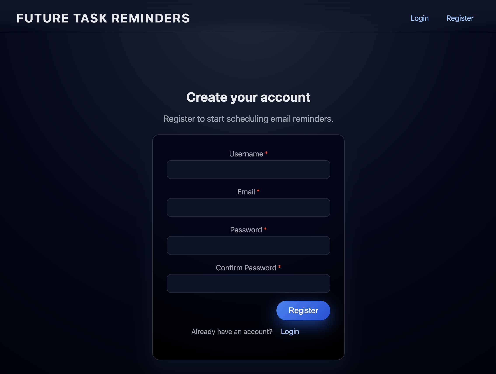
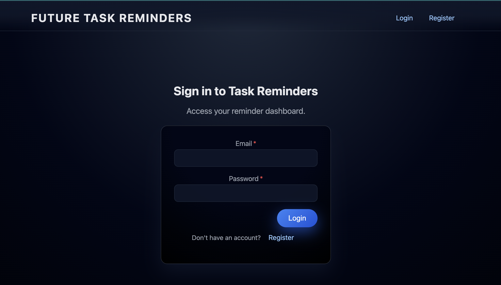
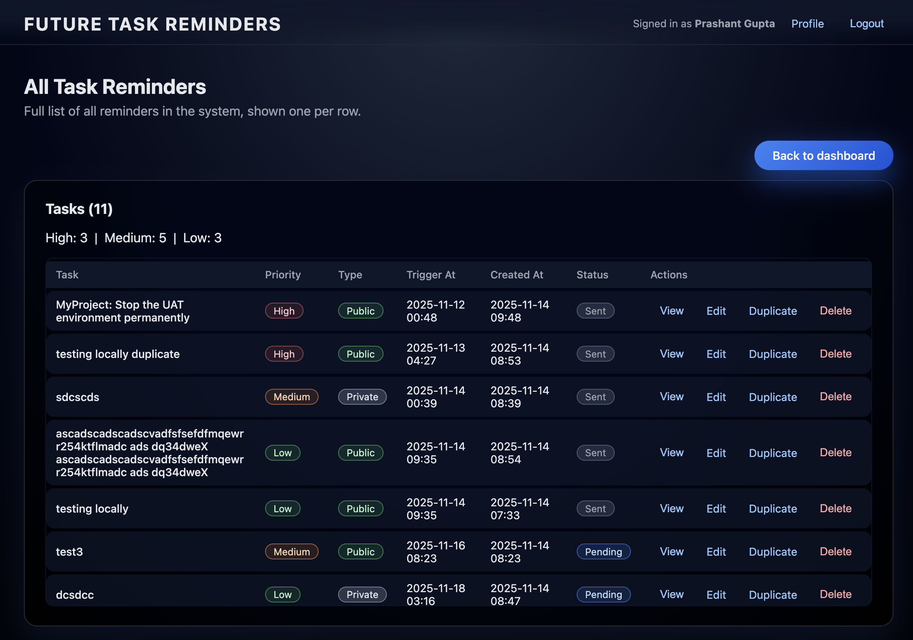
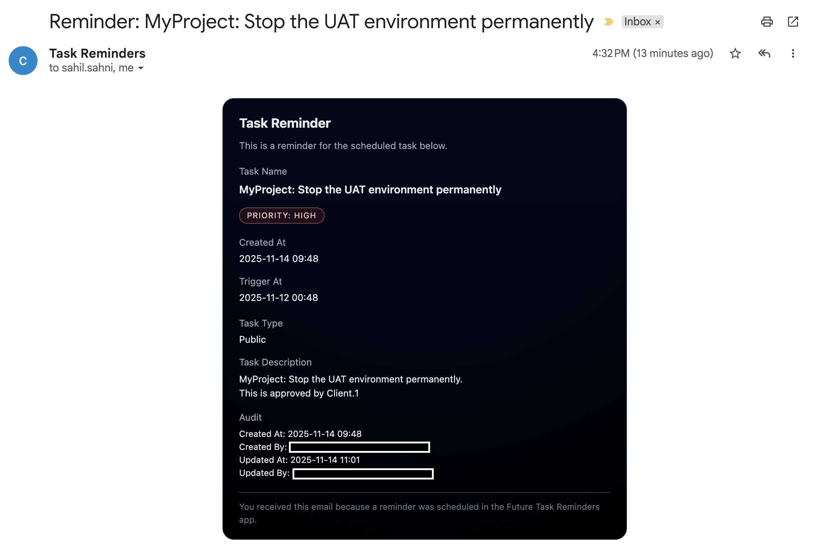

## Future Task Reminders

Node.js/Express dashboard to create and manage task reminders, store them in a MySQL database, and send reminder emails via SMTP when their trigger date/time is reached.

### Features

- **Dashboard summary**: See all tasks with counts of **high**, **medium**, and **low** priority.
- **Task form**: Create a task with **name**, **description**, **priority**, **trigger date/time**, **type**, **execution protection**, and **email recipients**.
- **Execution Protection**: Control how reminders are sent:
  - **None** (default): Reminder is sent once when trigger time is reached
  - **Daily**: Reminder is sent daily after trigger time until manually stopped
  - **Weekly**: Reminder is sent weekly after trigger time until manually stopped
  - **Monthly**: Reminder is sent monthly after trigger time until manually stopped
- **MySQL persistence**: Tasks are stored in a MySQL table.
- **SMTP reminders**: Dual schedulers check for due tasks and send emails via SMTP:
  - Immediate scheduler (`REMINDER_CRON`): Runs frequently for one-time reminders
  - Daily scheduler (`DAILY_CRON`): Runs daily for recurring reminders with execution protection

### UI Screenshots

- **Create Account**



- **Login**



- **Task Dashboard**


- **Task Lists**



- **Email Reminder**



### Prerequisites

- Node.js (LTS recommended)
- MySQL server
- SMTP credentials (can be from any provider that supports SMTP)

### 1. Clone and install

```bash
cd future-task-reminders
npm install
```

### 2. Create the MySQL database

In MySQL:

```sql
CREATE DATABASE task_reminders CHARACTER SET utf8mb4 COLLATE utf8mb4_unicode_ci;
```

You do **not** need to manually create the `tasks` table; it will be created automatically on server start via `initializeSchema()`.

### 3. Environment variables

Create a `.env` file in the project root, for example:

```bash
PORT=3000

# MySQL
DB_HOST=localhost
DB_PORT=3306
DB_USER=root
DB_PASSWORD=your_db_password
DB_NAME=task_reminders

# SMTP
SMTP_HOST=smtp.your-email-provider.com
SMTP_PORT=587
SMTP_SECURE=false
SMTP_USER=your_smtp_username
SMTP_PASS=your_smtp_password
SMTP_FROM="Task Reminders <no-reply@example.com>"

# Reminder check schedule (cron expression, default is every minute)
# This scheduler handles immediate reminders for tasks with execution_protection='none'
REMINDER_CRON=*/1 * * * *

# Daily reminder check schedule (cron expression, default is 9 AM daily)
# This scheduler handles recurring reminders for tasks with execution_protection='daily' or 'weekly'
DAILY_CRON=0 9 * * *

# Session secret
SESSION_SECRET=change_me_for_production
```

### 4. Run the app

```bash
npm start
```

Then open `http://localhost:3000` in your browser.

### 5. Usage

- **Create tasks** from the form on the dashboard with the following fields:
  - **Task Name**: Name of the task
  - **Description**: Optional description
  - **Priority**: High, Medium, or Low
  - **Trigger Date & Time**: When the reminder should be sent
  - **Task Type**: Public (visible to all) or Private (visible only to creator)
  - **Execution Protection**: 
    - **None**: Send reminder once when trigger time is reached
    - **Daily**: Send reminder daily after trigger time (continues until changed to 'none')
    - **Weekly**: Send reminder weekly after trigger time (continues until changed to 'none')
    - **Monthly**: Send reminder monthly after trigger time (continues until changed to 'none')
  - **Email Recipients**: Comma-separated list of email addresses
- **View all tasks** in the table, including their priority, trigger time, execution protection status, recipients, and whether the reminder email has been sent.
- **Edit tasks** to update any field, including changing execution protection to stop recurring reminders.
- **Duplicate tasks** to create new tasks based on existing ones.
- The **schedulers** run at the intervals specified by `REMINDER_CRON` and `DAILY_CRON`:
  - Tasks with `execution_protection='none'` are sent once when `trigger_at <= NOW()` and `is_reminded = 0`
  - Tasks with `execution_protection='daily'` are sent daily after trigger time (if `last_reminded_at` is NULL or more than 1 day ago)
  - Tasks with `execution_protection='weekly'` are sent weekly after trigger time (if `last_reminded_at` is NULL or more than 1 week ago)
  - Tasks with `execution_protection='monthly'` are sent monthly after trigger time (if `last_reminded_at` is NULL or more than 1 month ago)
  - Tasks are prioritized by execution protection (daily > weekly > monthly > none), then by priority

### 6. Production deployment checklist

- **Environment variables**
  - Set strong values for `SESSION_SECRET`, DB password, and SMTP credentials.
  - Use a production MySQL instance (managed service or your own server).
  - Point `DB_HOST` to the production DB host.
  - Configure `REMINDER_CRON` for immediate reminders (e.g., `*/1 * * * *` for every minute).
  - Configure `DAILY_CRON` for recurring reminders (e.g., `0 9 * * *` for 9 AM daily).
- **Security**
  - Serve the app behind HTTPS (e.g. with Nginx/Traefik or a cloud load balancer).
  - Restrict MySQL and SMTP access to trusted networks only.
  - Rotate SMTP and DB credentials regularly.
- **App runtime**
  - Run with `NODE_ENV=production`.
  - Use a process manager (e.g. `pm2`) or a container orchestration platform (Docker/Kubernetes) for restarts and health checks.
- **Email**
  - Ensure your SMTP provider is configured for production (SPF/DKIM/DMARC) so reminder emails don’t land in spam.
- **Backups & monitoring**
  - Enable regular backups for the `task_reminders` database.
  - Add basic monitoring/alerts for app errors and DB health.

### 7. Docker build & run

A simple `Dockerfile` is included to run the app in a container.

#### Build

```bash
docker build -t future-task-reminders .
```

#### Run (with external MySQL)

```bash
docker run -d \
  --name future-task-reminders \
  -p 3000:3000 \
  -e NODE_ENV=production \
  -e PORT=3000 \
  -e DB_HOST=your-mysql-host \
  -e DB_PORT=3306 \
  -e DB_USER=your_db_user \
  -e DB_PASSWORD=your_db_password \
  -e DB_NAME=task_reminders \
  -e SMTP_HOST=smtp.your-email-provider.com \
  -e SMTP_PORT=587 \
  -e SMTP_SECURE=false \
  -e SMTP_USER=your_smtp_username \
  -e SMTP_PASS=your_smtp_password \
  -e SMTP_FROM="Task Reminders <no-reply@example.com>" \
  -e REMINDER_CRON="*/1 * * * *" \
  -e DAILY_CRON="0 9 * * *" \
  -e SESSION_SECRET="your_strong_random_secret" \
  future-task-reminders
```

Then access the app at `http://localhost:3000`.

#### Run with Docker Compose

A `docker-compose.yml` file is included for easier deployment with MySQL:

```bash
docker-compose up -d
```

This will start both the MySQL database and the application. Make sure to update the environment variables in `docker-compose.yml` with your actual SMTP credentials and other configuration before running.

The compose file includes:
- MySQL 8.0 database service
- Application service with all required environment variables
- Automatic volume persistence for database data
